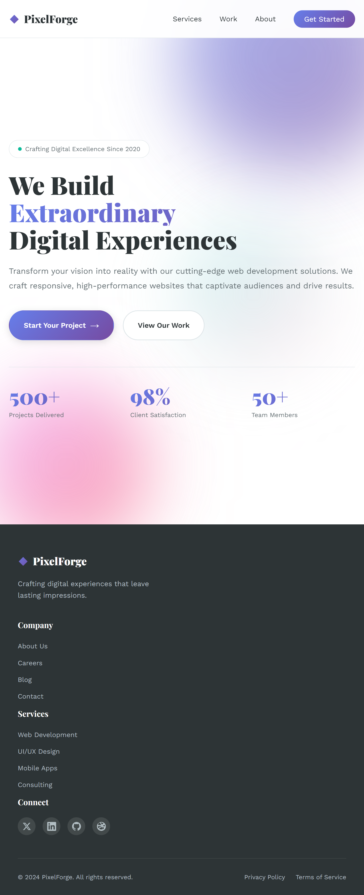
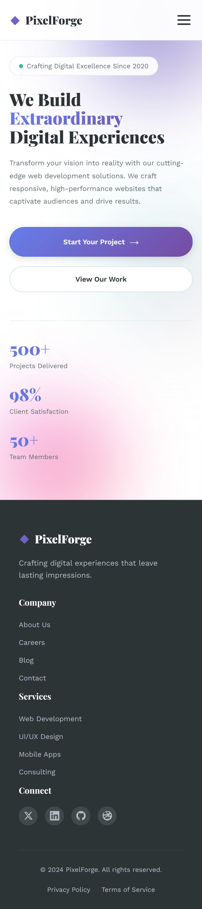

# 🚀 Responsive Landing Page - Web Development Internship Task 1

A modern, fully responsive landing page built with HTML5 and CSS3, featuring a clean design, smooth animations, and mobile-first approach.

## 📸 Preview

### Desktop View


### Tablet View


### Mobile View


## 📋 Project Overview

This project demonstrates a professional landing page with:
- Semantic HTML5 structure
- Modern CSS3 styling with Flexbox and Grid
- Fully responsive design (desktop, tablet, mobile)
- Smooth animations and transitions
- Mobile hamburger menu
- Optimized performance

## 🎨 Features

### Design Elements
- **Modern Aesthetic**: Contemporary design with gradient backgrounds and smooth animations
- **Typography**: Custom Google Fonts (Playfair Display + Work Sans)
- **Color Scheme**: Professional color palette with CSS variables for easy customization
- **Interactive Elements**: Hover effects, smooth scrolling, and animated components

### Technical Implementation
- **Semantic HTML5**: Proper use of `<header>`, `<nav>`, `<main>`, `<section>`, `<footer>` tags
- **CSS Flexbox**: Used for navigation, buttons, and flexible layouts
- **CSS Grid**: Used for footer columns and stats section
- **Media Queries**: Responsive breakpoints at 992px, 768px, and 480px
- **Mobile Menu**: Hamburger menu with smooth slide-in animation
- **Accessibility**: ARIA labels, semantic markup, reduced motion support

## 📁 File Structure

```
your-repo/
├── index.html
├── style.css
├── README.md         
└── screenshots/            
    ├── desktop.png
    ├── tablet.png
    └── mobile.png
```

## 🚀 How to Run

### Method 1: Using Live Server (Recommended)
1. Install VS Code
2. Install "Live Server" extension
3. Right-click on `index.html`
4. Select "Open with Live Server"

### Method 2: Direct Browser
1. Double-click `index.html`
2. Opens in default browser

### Method 3: Python Server
```bash
# Python 3
python -m http.server 8000

# Then open: http://localhost:8000
```

## 📱 Responsive Breakpoints

- **Desktop**: 1200px and above
- **Tablet**: 768px - 992px
- **Mobile Landscape**: 480px - 768px
- **Mobile Portrait**: Below 480px

## 🎯 Key Concepts Demonstrated

### 1. Semantic HTML
- Proper use of `<header>`, `<nav>`, `<main>`, `<section>`, `<footer>`
- ARIA labels for accessibility
- Meaningful class names

### 2. CSS Flexbox
- Navigation bar layout
- Button groups
- Social media links
- Footer bottom section

### 3. CSS Grid
- Footer columns (4-column layout)
- Hero stats section
- Responsive grid adjustments

### 4. Media Queries
- Mobile-first approach
- Responsive navigation (hamburger menu)
- Flexible typography scaling
- Grid column adjustments

### 5. CSS Animations
- Floating gradient orbs
- Fade-in-up hero content
- Smooth transitions
- Hover effects

## 🔧 Customization

### Change Colors
Edit CSS variables in `style.css`:
```css
:root {
    --primary-color: #your-color;
    --secondary-color: #your-color;
    /* ... */
}
```

### Change Fonts
Replace Google Fonts in `index.html`:
```html
<link href="https://fonts.googleapis.com/css2?family=Your+Font&display=swap" rel="stylesheet">
```

## ✅ Testing Checklist

- [x] Desktop view (1200px+)
- [x] Tablet view (768px - 992px)
- [x] Mobile view (< 768px)
- [x] Mobile menu functionality
- [x] Smooth scrolling
- [x] Hover effects
- [x] All links work
- [x] Responsive images
- [x] Cross-browser compatibility

## 🌐 Browser Support

- Chrome (latest)
- Firefox (latest)
- Safari (latest)
- Edge (latest)
- Mobile browsers (iOS Safari, Chrome Mobile)

## 📚 Technologies Used

- HTML5
- CSS3
- JavaScript (vanilla - for mobile menu)
- Google Fonts
- CSS Grid & Flexbox
- CSS Animations
- Media Queries


## 📖 Additional Resources

- [MDN Web Docs](https://developer.mozilla.org/)
- [CSS Tricks](https://css-tricks.com/)
- [Can I Use](https://caniuse.com/) - Browser compatibility
- [Google Fonts](https://fonts.google.com/)

## 👨‍💻 Author

Created as part of Web Development Internship - Task 1

## 📄 License

This project is open source and available for educational purposes.

---

**Note**: This landing page is created for learning purposes and demonstrates modern web development practices including semantic HTML, CSS Flexbox/Grid, responsive design, and accessibility considerations.
